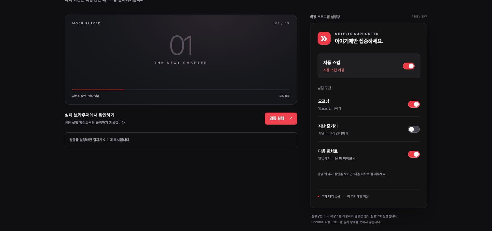

# Netflix Supporter

**버튼이 켜지면, 이야기는 계속됩니다.**

Netflix의 오프닝·지난 줄거리·다음 회차 버튼을 클릭 가능한 시점에 자동으로 누르는 가벼운 Chrome 확장 프로그램입니다. 인위적인 대기나 영상 위 추가 UI 없이 동작합니다.

> 개발용 첫 버전입니다. 자동 테스트와 Chrome 모의 화면 검증을 완료했으며, 실제 Netflix 재생 및 확장 설치 통합 검증은 아직 완료하지 않았습니다. Netflix가 제공하거나 승인한 공식 제품이 아닙니다.



## 기능

| 기능 | 동작 |
| --- | --- |
| 오프닝 | 인트로 건너뛰기 버튼 자동 클릭 |
| 지난 줄거리 | 지난 이야기 건너뛰기 버튼 자동 클릭 |
| 다음 회차 | 엔딩의 전용 다음 회차 버튼 자동 클릭 |
| 설정 | 전체·종류별 ON/OFF, 기기 로컬 저장 |

추천작 일반 재생 버튼, 본편 도중 상시 다음 버튼, 광고 스킵, 영상 분석, 북마크·자막 수집은 포함하지 않습니다. 엔딩 뒤 추가 장면을 보려면 '다음 회차로'를 꺼두세요.

## 설치

Chrome 120 이상을 대상으로 합니다. 전달받은 ZIP을 풀고 `chrome://extensions` → 개발자 모드 → **압축해제된 확장 프로그램을 로드합니다** → `extension` 폴더를 선택합니다. Netflix 탭은 새로고침하세요.

소스에서 설치하려면:

```sh
npm ci
npm run check
```

생성된 `dist` 폴더를 Chrome에 로드합니다. 개발 도구는 Node.js 22 이상이며 ZIP 사용자에게 Node.js는 필요하지 않습니다. [한국어 설치 안내](docs/INSTALL.ko.md)

## 설계

- **반복 타이머 없음:** DOM 변경과 관련 이벤트에 반응하고 추가된 부분을 중심으로 확인합니다.
- **클릭 시 네트워크·저장소 대기 없음:** 설정은 미리 읽어 메모리에 유지합니다.
- **보수적인 판별:** 정확한 UI hook과 표시·활성 상태를 확인하며 같은 버튼과 즉시 재생성 버튼의 중복을 억제합니다.
- **작은 실행 코드:** 프레임워크·외부 런타임 의존성·백그라운드 워커가 없습니다. 설정창은 열 때만 로드합니다.
- **최소 권한:** storage와 Netflix 사이트 콘텐츠 스크립트만 사용합니다. 서버·분석 도구·계정 API·원격 코드가 없습니다.

TypeScript · Chrome Manifest V3 · esbuild · Vitest/jsdom. ZIP 라이브러리는 개발 도구이며 확장 실행 코드에는 포함되지 않습니다.

## 검증과 재현

```sh
npm run check     # 타입 검사 → 회귀 테스트 → 빌드
npm run dev       # http://127.0.0.1:4173 모의 플레이어와 설정창
npm run package   # 설치 ZIP + SHA-256
```

모의 플레이어의 '검증 실행'으로 실제 브라우저에서 버튼 삽입·활성화, 숨김, 중복 억제, 회차 전환 등을 재현합니다. 미리보기 저장소는 실제 Chrome 확장 저장소와 구분합니다. 측정값을 Netflix 실서비스 성능으로 일반화하지 않습니다. [검증 결과와 미확인 범위](docs/VALIDATION.md)

## 작업 이력과 포트폴리오

감지 엔진, 다음 회차 경계, 설정·배포의 세 작업 단위로 개발했습니다. 각 기능과 테스트를 함께 커밋하고 의존하는 PR은 앞 브랜치를 기준으로 검토합니다. [브랜치·PR 계획](docs/PR-PLAN.md)

- [구조와 기술 선택, 실제 해결한 문제](docs/ARCHITECTURE.md)
- [이벤트 감지·중복 억제 결정](docs/decisions/001-event-driven-engine.md)
- [엔딩과 추천작 구분 결정](docs/decisions/002-next-episode-boundary.md)
- [인증 범위와 GitHub 게시](docs/GITHUB-SETUP.md)

AI 지원으로 구현·테스트·문서를 작성했습니다. 실제 검증과 모의 검증, 요구 정의와 AI 지원 범위를 구분해서 기록합니다.
