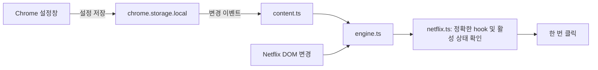

# 구조와 설명 포인트

## 파일별 책임

- `netflix.ts`: Netflix의 불안정한 UI 식별자를 한 곳에 모으고, 클릭 가능한 상태인지 확인한다.
- `engine.ts`: 변경 감지, 후보 버튼 관리, 회차 경로, 중복 클릭 억제와 설정 반영을 맡는다.
- `content.ts`: Chrome 저장소를 읽고 엔진을 연결한다. 설정을 읽기 전에는 클릭하지 않는다.
- `popup-ui.ts`: UI 상태와 오류 복구. 실제 Chrome 저장소와 모의 저장소를 같은 UI로 검증할 수 있도록 인터페이스를 분리한다.
- `popup.ts`: 실제 Chrome 저장소 연결. 팝업을 열었을 때만 로드된다.
- `demo/`: 실제 영상·계정 없이 동작을 재현하는 개발용 페이지. 배포 확장에는 포함되지 않는다.

## 왜 React나 서버를 쓰지 않았나

표시할 설정은 네 개의 스위치뿐이다. 프레임워크 없이 DOM을 직접 갱신하면 실행 의존성·빌드 결과를 작게 유지할 수 있다. 개인 설정은 기기에 저장하며 동기화·로그인·분석 서버가 필요하지 않다.

## 이벤트를 사용하면 항상 0ms인가

아니다. 이벤트 기반 설계는 주기적 검색의 대기 구간을 제거하지만 메인 스레드 지연, 초기 설정 로드, 렌더링과 서비스의 클릭 처리 시간은 남는다. 모의 화면에서 관측한 지연은 해당 환경의 일부 시나리오에 대한 결과이며 서비스 전체 성능을 증명하지 않는다.

## 왜 문서에 observer를 붙이나

Netflix는 페이지 전체를 새로고침하지 않고 browse/watch 전환이나 플레이어 교체를 할 수 있다. 특정 플레이어 노드 하나만 관찰하면 그 노드가 교체될 때 끊길 수 있다. 문서 수명 동안 관찰하되 추가된 부분만 검색하고 관계없는 속성·자막 변경의 레이아웃 재검사를 피한다. 전체 OFF에서는 observer도 분리한다.

## 실제로 발견하고 수정한 문제

추가 노드에 버튼이 없으면 검사를 생략하는 최적화 후, browse에서 watch로 이동할 때 경로 갱신으로 발견한 버튼이 처리되지 않는 회귀가 발생했다. 경로 변경 자체를 유효한 처리 사유로 포함하고 SPA 진입 회귀 테스트로 확인했다.

설정창 미리보기는 실제 DOM 높이가 558px여서 초기 iframe에서 하단 안내가 잘렸다. 실제 브라우저에서 측정하고 미리보기 높이를 늘렸다. 이러한 모의 UI 확인은 확장 설치·Netflix 통합 검증과 구분한다.

## 면접에서 설명할 수 있는 질문

1. polling보다 observer를 택한 이유와 observer 자체의 비용은?
2. DOM 존재와 사용자가 클릭 가능한 상태를 어떻게 구분했나?
3. React식 노드 재생성과 회차 전환 사이에서 중복 억제 상태는 어떻게 관리하나?
4. 추천 작품 오클릭을 막기 위해 포기한 범용성은 무엇인가?
5. 저장된 OFF 상태와 비동기 초기 로드의 경쟁은 어떻게 막았나?

AI 지원으로 설계·코드·테스트·문서를 작성했다. 포트폴리오에서는 사용자의 요구 정의와 검토, 실제 수행한 검증을 구분해서 설명하고 수동 개발이나 협업 이력을 꾸며내지 않는다.
